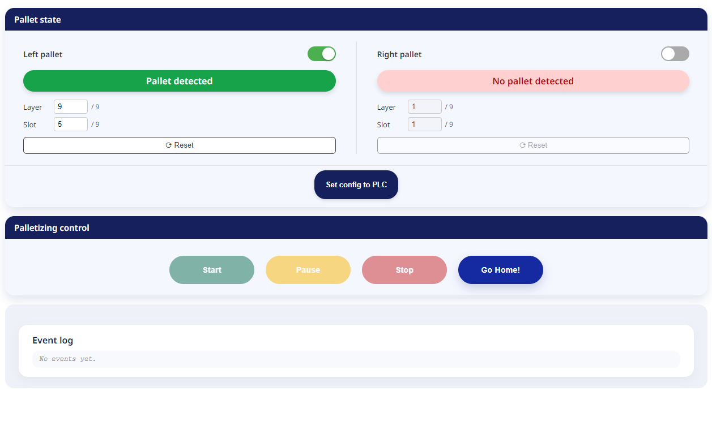
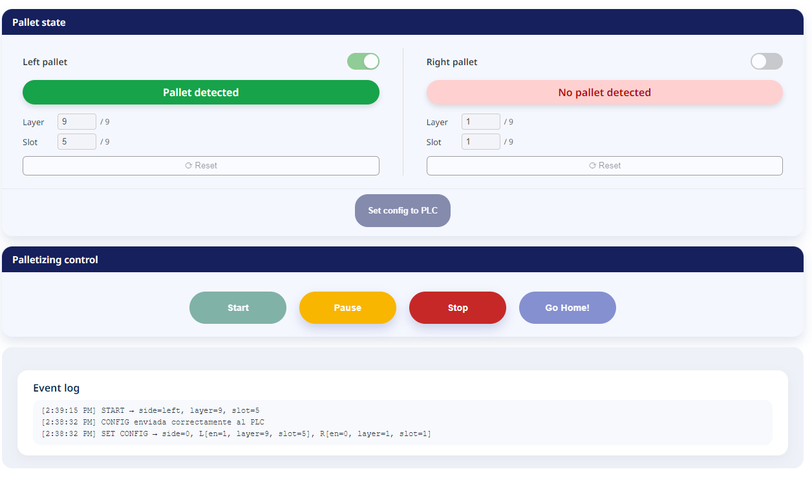
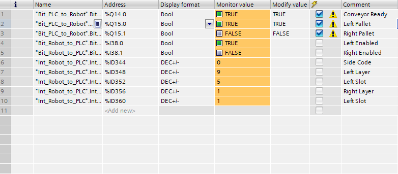

# Palletizing HMI Module  
### Doosan Robotics (DART API v4) + Siemens S7-1200 PLC (PROFINET)

This project implements a full Palletizing HMI developed using **React + Doosan DART API v4**, designed for an industrial palletizing cell.  
The interface communicates with both the **Doosan Robot Controller** and a **Siemens S7-1200 PLC** via PROFINET (IndustrialEthernet).

The module allows:
- Selecting palletizing side (Left / Right / Both)  
- Layer and Slot configuration  
- Pallet presence detection (PLC → Robot → HMI)  
- Sending configuration to PLC  
- Robot execution controls  
- Real-time event logging  
- Visual PLC register state feedback  

---

# System Architecture

[HMI React (DART Module)] 
↓ IndustrialEthernet (PROFINET) 
[Siemens S7-1200 PLC] 
↓ GPR I/O Mapping 
[Doosan Robot Controller]

### Communication Channels
- **HMI → PLC:** Enabled sides, side code, layer, slot  
- **PLC → HMI:** Pallet presence bits  
- **HMI → Robot:** DRL program execution & control commands  
- **Robot → PLC:** Palletizing status (extendable)

---

# HMI Overview

## Pallet Detected (Left Side)

---

## Event Log Showing Actions

---
## Configuration Sent to PLC

---

# PLC Register Map (GPR Mapping)

The communication between Doosan DART and Siemens PLC uses **General Purpose Registers** (GPR), mapped as follows:

## Input GPR (PLC → HMI)

| GPR | Type | Description |
|-----|------|-------------|
| **D8** | BIT | Left Pallet Present |
| **D9** | BIT | Right Pallet Present |

---

## Output GPR (HMI → PLC)

### Boolean Outputs
| GPR | Type | Description |
|-----|------|-------------|
| **D0** | BIT | Left Enabled |
| **D1** | BIT | Right Enabled |

### Integer Outputs
| GPR | Type | Description |
|------|------|-------------|
| **D0** | INT | Side Code (0=Left, 1=Right, 2=Both) |
| **D1** | INT | Left Layer |
| **D2** | INT | Left Slot |
| **D3** | INT | Right Layer |
| **D4** | INT | Right Slot |

---

# HMI Logic & Safety Rules

### ✔ Input Safety Rules
The UI **automatically disables Start and Set Config** if:

- A side is enabled but no pallet is detected  
- Layer/Slot fields are invalid  
- Configuration was not yet sent to PLC  

### ✔ Configuration Lock
After sending configuration to PLC:

- Layer/Slot inputs become **locked**
- Only Reset can unlock them  

### ✔ Runtime Lock
While the robot is running:

- All inputs are disabled  
- Reset is disabled  
- Only Pause / Continue / Stop remain active  

---

# Control Actions

| Button | Behavior |
|--------|----------|
| **Set Config to PLC** | Sends sideCode, layer, slot, and enable bits |
| **Start** | Launches the palletizing DRL program |
| **Pause** | Uses DART API `pauseProgram()` |
| **Continue** | Uses DART API `resumeProgram()` |
| **Stop** | Quick stop using `stopProgram(QUICK)` |
| **Go Home** | Placeholder for homing DRL program |

---

# Technologies Used

- **React**
- **TypeScript**
- **Doosan DART API v4**
- **Siemens PROFINET (IndustrialEthernet)**
- **SCSS Styling**
- **DRL (Doosan Robot Language)**

---

# Author

**Mario Padilla**  
Industrial Automation Engineer  
Robotics • PLC • Vision Systems • Software Development  
GitHub: https://github.com/ByGalozs
